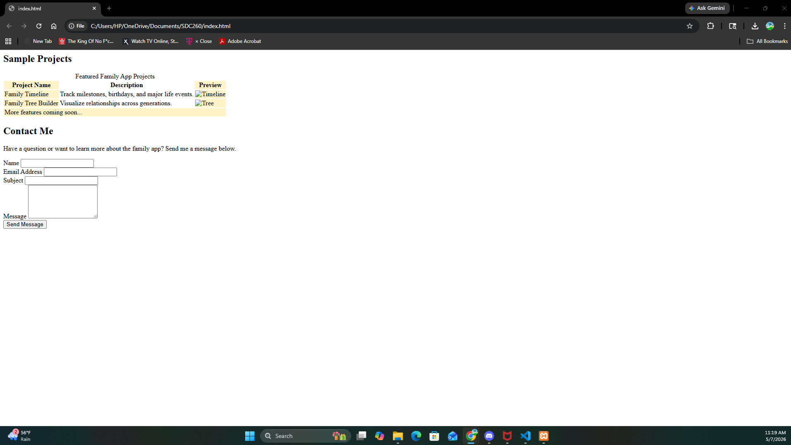

# Family Social App Landing Page

## Project Overview

This project is a responsive landing page for a family-focused social media application. The website highlights features such as family timelines, family tree building, and communication tools designed to strengthen family connections.

The webpage was created using:

- HTML5
- CSS3
- Flexbox
- CSS Grid
- Responsive Web Design
- Forms and Tables

---

## Features

- Responsive navigation bar
- Hero section with background image
- Feature cards using CSS Grid
- Project showcase table
- Contact form with validation
- Mobile-friendly layout
- Hover animations and transitions

---

## Technologies Used

- HTML5
- CSS3
- Visual Studio Code
- GitHub Pages
- XAMPP

---

## GitHub Repository

[Add your GitHub repository link here]

---

## Live Website

[Add your GitHub Pages website link here]

---

## Local Hosting Screenshot

Add your screenshot below after running the project locally with XAMPP.

---

## Author

Brian Taylor

---

## AI Assistance

This project used AI assistance for:
- README structure guidance
- XAMPP setup guidance
- Debugging support
- Responsive design improvements